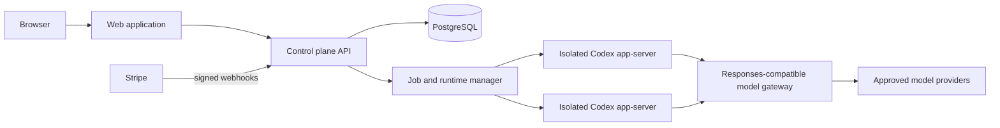

# ADR-0001: Keep Codex as an isolated agent runtime behind a tenant-aware control plane

- Status: Accepted product boundary; production hardening incomplete
- Date: 2026-09-02
- Owners: Agent Harness maintainers
- Upstream baseline: `openai/codex` at `e8b3253fed5aeef7e914441bc3b73b3b0a718b51`

## Context

The product needs a Codex-like agent experience with organizations, users, projects, provider routing, and subscriptions. The checked-in Codex submodule supplies the agent runtime, thread/turn/item protocol, approvals, sandbox integration, and local thread storage. It does not supply a reusable copy of OpenAI's hosted multi-user control plane or proprietary desktop UI.

`codex app-server` is a local JSON-RPC server. Its supported default transport is stdio; its TCP WebSocket transport is explicitly experimental and unsupported. Codex provider definitions now use the OpenAI Responses wire protocol only. These constraints make app-server a useful runtime boundary, but not a safe public multi-tenant API.

## Decision

Agent Harness will preserve Codex as a pinned, mostly unmodified runtime and add a separate tenant-aware control plane around it.

### Target runtime boundary

Each active `(organization, user, workspace)` execution gets an isolated OS process or container running `codex app-server`. The control plane connects over stdio, or a private Unix socket where process supervision requires reconnects. It must not expose app-server directly to a browser or public network, and it must not multiplex mutually untrusted tenants into one process.

Every runtime receives:

- a dedicated OS identity or container, workspace mount, process namespace, and `CODEX_HOME`;
- a control-plane-generated Codex configuration, never a provider configuration controlled by the repository;
- a short-lived, tenant-scoped gateway credential rather than provider credentials;
- a server-selected permission profile, sandbox policy, working directory, and model allow-list;
- resource, wall-clock, process, filesystem, and egress limits;
- a correlation tuple containing organization, user, project, workspace, thread, turn, and runtime IDs.

The browser addresses product resource IDs. Only the control plane maps those IDs to Codex thread IDs and runtime locations. Every lookup and mutation must include the authenticated organization scope.

### Model gateway boundary

Codex talks only to a Responses-compatible gateway. Public model names are stable route aliases such as `codex-openai` or `codex-anthropic`; provider model identifiers and credentials stay behind the gateway. A route is eligible only after it passes the Codex Responses contract suite, including streaming events, tool calls, reasoning fields, usage, cancellation, and error mapping.

The optional LiteLLM scaffold in `infra/litellm` is for local evaluation and preview integration. It is not the subscription ledger, entitlement authority, or proof of production tenant isolation. Production can retain LiteLLM only after a security review and can replace it without changing the Codex/runtime contract.

### Persistence and ownership

PostgreSQL is the target production authority for organizations, memberships, projects, workspace grants, runtime mappings, provider-route grants, subscription state, entitlements, quota reservations, immutable usage records, and audit events. The current production-foundation preview uses SQLite with ordered, checksummed migrations for local development and trusted pilots.

For the preview, Codex's `LocalThreadStore` may keep JSONL history and SQLite metadata in per-user runtime directories. The control plane now persists tenant/user/thread/workspace bindings and restricts access through those bindings; complete product-owned thread catalog and event persistence are still required. Before horizontal production scale, choose one of:

1. implement a shared `ThreadStore` with tenant keys and database-level isolation; or
2. retain isolated durable volumes and build an explicit placement, backup, restore, and migration service.

Object storage may hold encrypted large artifacts and redacted logs. PostgreSQL records their tenant ownership and retention policy.

### Identity, roles, and subscriptions

The implemented preview role set is `admin` and `member`. The target role set separates owner, organization administrator, billing administrator, member/operator, viewer/auditor, and platform administrator. Authorization remains organization-scoped and server-side; platform administration must become a separate role and session surface rather than being inferred from an organization role.

Subscriptions belong to organizations. Stripe is an external payment event source, while the control-plane entitlement snapshot is the runtime authorization source. The preview verifies webhook signatures, durably deduplicates processed event IDs, rejects older subscription events, preserves Stripe billing periods, and atomically updates subscription, entitlement, and audit state. Seat creation/reactivation and active-run/request admission enforce current snapshots transactionally. A durable raw-event inbox, same-timestamp tie-break, background processor reconciliation, monetary budgets, and price/provider reconciliation remain target requirements. Client-supplied prices or usage never become authoritative.

### Repository trust

Repositories, prompts, generated patches, `AGENTS.md`, `.codex` configuration, hooks, MCP servers, plugins, and skills are untrusted input. The current preview does not expose hooks, repository-selected plugins/skills, or arbitrary MCP servers as product capabilities. Future enablement requires an explicit, signed allow-list and permission policy. Project-local Codex configuration must not select provider endpoints, credentials, or a more permissive sandbox.

### Uploaded content

User-uploaded files are untrusted input of the same class as a repository, and they arrive by a path the user controls end to end. They are therefore given their own store rather than a workspace, and their content is never given instruction authority.

Bytes are stored under `UPLOAD_DATA_DIR`, which the control plane creates at 0700 and which **must not contain, or be contained by, any entry of `ALLOWED_WORKSPACE_ROOTS`**. `buildApp` asserts this over `realpath`'d paths before the store is opened and refuses to start otherwise. Writing uploads into a bound workspace was rejected: it dirties the tree the user's own `git status` and `review/start { uncommittedChanges }` observe, it is visible to every thread and every grant-holder on that project rather than to the one thread that owns it, and it places durable customer data on a path the control plane does not own and therefore cannot retain, delete, or garbage-collect.

No client-supplied byte becomes a path component. The blob name is a server-generated UUID, the staged extension comes from a fixed map keyed on the server's own content classification, and the client's filename is retained only as a length-capped, normalized display label. Content type is decided by the server from the bytes — the wire type is fixed to `application/octet-stream`, so there is nothing for a client to declare and nothing to reconcile. Blobs are encrypted at rest (AES-256-GCM, per-upload data key wrapped with the application credential key) and are never executed, interpreted, or linked by the control plane.

Extraction is an ordinary approval-gated turn, not a separate pipeline. Uploading performs no model call and no dispatch. When a turn references an upload, the control plane resolves the opaque ID to a path server-side, stages decrypted plaintext for that turn alone, and appends a server-authored envelope that names the paths and states that their content is data. The agent reads them with its normal tools, so **the bytes reach the model as tool output rather than as an input item** — the lowest-trust channel available. The browser supplies opaque upload IDs only; it never supplies a path or a URL, and no `localImage`/`localAudio`/`mention`/`skill` input variant is accepted, because each of those carries a filesystem path that the app-server reads directly.

**Residual risk, stated rather than solved.** `SandboxPolicy::has_full_disk_read_access()` is unconditionally true in the pinned Codex, so an agent can read any path the server's OS user can read. Placement of uploads is therefore a hygiene, authorization, and lifecycle decision — **not a containment one** — and encryption at rest bounds steady-state exposure to ciphertext plus one turn's staged plaintext in the reading user's own shard. This is invariant 3 restated for a new asset, it is pre-existing (thread transcripts and the SQLite file are already readable the same way), and the fix is per-tenant OS identity or kernel isolation, not anything the upload feature can do on its own.

## Security invariants

The following are release-blocking invariants, not future enhancements:

1. No provider key, Stripe secret, session secret, or bootstrap password is stored in Git, sent to a browser, written into a workspace, or inherited by the agent shell.
2. A user cannot supply or override `organization_id`, owner IDs, provider credentials, gateway routes, runtime locations, or billing amounts without server-side authorization.
3. A runtime cannot read another tenant's `CODEX_HOME`, workspace, thread history, Unix socket, network identity, or gateway credential.
4. App-server accepts traffic only from its supervising control-plane worker.
5. Model gateway calls carry a short-lived identity that is bound to one tenant and an allowed route set.
6. Provider requests and usage reconciliation share an idempotency/correlation ID.
7. High-risk tool actions require an approval decision recorded against the same user, tenant, thread, turn, and item.
8. Logs redact authorization headers, cookies, prompt content by policy, tool output secrets, and sensitive filesystem paths.
9. Uploaded bytes are stored outside every configured workspace root, at server-derived paths; no client-supplied byte becomes a path component, and no client-supplied value selects a content type.
10. Uploaded content never carries instruction authority. It reaches a model only as tool output inside an approval-gated turn, and a thread holding an attachment cannot grant session-wide approval authority — only per-command decisions.

## Production-foundation preview boundary

The preview is a controlled deployment for local development and trusted pilot tenants, not an internet-scale hostile multi-tenant service.

| Area | Current preview foundation | Required before broad production |
| --- | --- | --- |
| Runtime | One supervised app-server process and private runtime directory per tenant user | Hardened per-task/user microVM or container isolation, egress proxy, image attestation, automated cleanup |
| Storage | SQLite control plane with checksummed migrations and per-user Codex state | PostgreSQL authority with tenant defense in depth, tested HA, encrypted backups, restore drills, retention/deletion workflows |
| Gateway | Loopback/private LiteLLM or equivalent, fixed aliases, master-key access from control plane | Tenant-scoped short-lived credentials, HA data plane, route-level policy, independent usage ledger |
| Authentication | Argon2 password hashing, signed HttpOnly sessions, mandatory bootstrap-password rotation, login rate limiting | SSO/OIDC, MFA for privileged roles, risk-based controls, formal account recovery |
| Authorization | Central organization-scoped checks and negative tests | Database row-level defense in depth, policy review, continuous authorization telemetry |
| Billing | Stripe test mode, signature-verified webhooks, durable processed-event deduplication/stale rejection, versioned entitlement snapshots, and transactional seat/active-run/request admission | Durable raw-event ingestion, deterministic total ordering, monetary budgets, provider/price reconciliation, dispute/refund handling, finance audit exports |
| Agent features | Built-in tools only; hooks, arbitrary MCP, repo skills/plugins disabled | Signed/approved catalog, permission manifests, per-capability policy and revocation |

A preview exception never permits a shared writable workspace, shared `CODEX_HOME`, public app-server listener, browser-visible provider key, hard-coded admin credential, unsigned webhook, or client-enforced entitlement.

## Verification gates

Before a preview is promoted beyond trusted pilots:

- contract-test the pinned app-server initialize, thread start/resume/fork, turn streaming, approval, interrupt, and failure flows;
- run cross-tenant negative tests for every list/read/write endpoint and guessed identifier;
- prove two concurrent runtimes cannot read each other's workspace, process environment, socket, or thread store;
- scan Git history, container layers, logs, crash reports, and browser payloads for seeded canary secrets;
- run a Codex `/v1/responses` compatibility suite against every enabled alias;
- test quota reservation races, retries, cancellation, provider timeouts, and duplicate Stripe webhooks;
- test sandbox escapes, symlink/path traversal, SSRF, egress restrictions, approval replay, and prompt-injected tool calls;
- for uploads specifically: prove the store-versus-workspace-root assertion fails startup in both directions; prove a traversal, absolute, NUL, percent-encoded, or overlong filename never reaches the filesystem; plant a symlink and a hardlink at every directory component and at the target name and prove each is refused with nothing created outside the store; prove a tampered ciphertext fails its GCM tag before any plaintext path exists; race concurrent uploads against the last quota unit; prove another tenant's upload ID yields a 404 with no dispatch and no reservation; prove the server-authored envelope cannot be forged, including a marker split across input items or written with zero-width and normalization-foldable characters; and prove `acceptForSession` is refused while a thread holds an attachment while per-command approval still works;
- restore an encrypted backup into an isolated environment and verify tenant deletion/retention behavior;
- generate app-server TypeScript and JSON schemas from the pinned Codex binary and fail CI on an unexplained protocol diff.

## Consequences

This design adds a supervisor/control-plane service and makes per-runtime isolation a capacity concern. It also keeps tenant authorization, billing, and credentials out of the Codex codebase, limits the long-lived fork surface, and allows the UI and gateway to evolve independently.

We reject these alternatives:

- **One public app-server for all users:** app-server transport is not a tenant authorization boundary.
- **Browser-to-provider calls:** this exposes credentials and bypasses entitlements, audit, and usage accounting.
- **A deep Codex fork as the product backend:** it increases upgrade risk and mixes product policy with an upstream agent runtime.
- **LiteLLM spend records as the sole billing ledger:** gateway telemetry is useful evidence, but subscription authorization and financial reconciliation remain control-plane responsibilities.

## References

- [Codex app-server documentation](https://developers.openai.com/codex/app-server)
- [Codex configuration reference](https://developers.openai.com/codex/config-reference)
- `codex/codex-rs/app-server/README.md`
- `codex/codex-rs/thread-store/README.md`
- `codex/codex-rs/responses-api-proxy/README.md`
