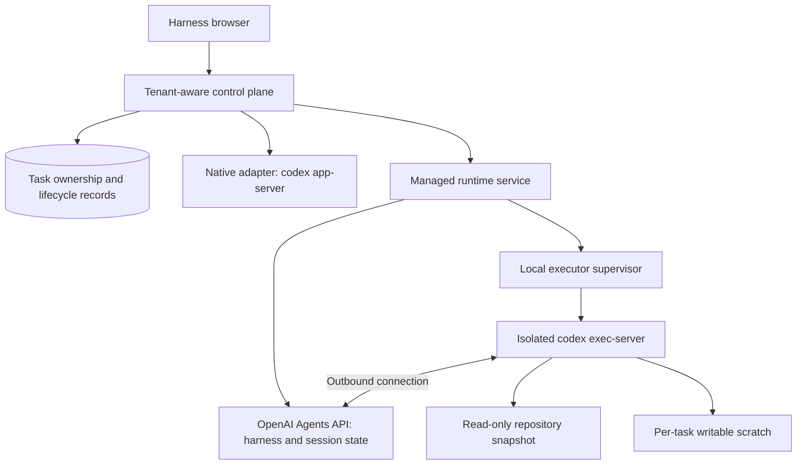

# ADR-0003: Add the managed Agents API as an optional runtime

- Status: Accepted for the controlled preview; credentialed service canary required before enablement
- Date: 2026-09-13
- Extends: [ADR-0001](ADR-0001-codex-runtime-boundary.md) and [ADR-0002](ADR-0002-shared-project-skills.md)
- Implementation contract: [Managed Agents runtime specification](managed-agents-runtime-spec.md)

## Context

Agent Harness currently supervises `codex app-server` locally. The control plane
owns tenant authentication, saved-project grants, provider selection, admission,
task bindings, audit records, and the browser API. Native Codex owns the agent
loop and local conversation state. That remains the default runtime.

The OpenAI Agents API adds an alternative: OpenAI operates the Codex harness and
stores session state, while a `self_hosted` environment runs `codex exec-server`
on infrastructure that we select. This is a distinct runtime protocol and data
boundary. It is not a Responses-compatible provider route and does not replace
our authorization, isolation, billing, or lifecycle responsibilities.

## Decision

Add an explicitly enabled managed runtime alongside the native adapter. The first
managed agent is a versioned, server-defined Repository Reviewer. It can inspect
an isolated repository snapshot, discuss its findings in follow-up turns, and be
cancelled. It cannot modify the saved project, receive arbitrary application
function tools or MCP configuration from the browser, or claim native workflow
capabilities that have not been implemented for this backend.

### Preserve the existing product boundary

Native task behavior, provider routes, local storage, and approvals remain on the
native adapter. A managed task is permanently associated with its backend; a
browser refresh or provider change does not convert its history into a native
thread. The browser supplies opaque product IDs and text, never cloud session
IDs, environment IDs, executor URLs, filesystem paths, credentials, raw runtime
RPC, tool definitions, or permission profiles.

The server authenticates every managed list, read, mutation, and event request.
It verifies both tenant and task owner, plus the saved-project grant, before
accessing the remote API or starting local compute. OpenAI project membership is
not a substitute for product tenant authorization.

### Make the cloud boundary explicit

Self-hosted execution does not mean offline execution or locally retained
conversation state. Prompts and tool results are processed by OpenAI and stored
as managed session history. At the time of this decision the Agents API supports
US data residency only and does not support Zero Data Retention, including with
self-hosted environments. The runtime selection and operator documentation must
state this before a managed task starts.

Enablement is deployment-owned and off by default. Operators must select a
suitable OpenAI project and decide which saved projects are appropriate for this
data boundary. An explicit tenant UUID allowlist gates managed admission; an
empty list admits nobody. A successful local build is not evidence that an account has
Agents API access or that the selected executor version can connect to it.

### Separate application and executor credentials

The control plane uses an application credential for Agents API session access
and inference. The executor receives a separate restricted environment key that
belongs to the same OpenAI organization, project, and user or service account.
The broader application credential must never enter the executor, snapshot,
scratch directory, browser payload, repository, or logs.

The restricted executor key is accessible to agent-generated code. Restriction
of this key is part of the boundary, not an implementation inconvenience to work
around. Keep third-party credentials outside the executor as well. V1 does not
provide brokered third-party tools.

### Require actual execution isolation

Every managed session gets its own environment ID and executor. A dedicated
directory, a read-only instruction, or `chmod` does not isolate a workload from
the server's files or other tenants. In particular, ADR-0001 records full-disk
read access in the pinned native sandbox, so its `readOnly` label cannot serve as
the managed runtime's filesystem containment guarantee.

The managed launcher must enforce an isolated filesystem view: the selected
repository snapshot is read-only; scratch, runtime home, and temporary files are
private to the task; unrelated host workspaces, application state, credentials,
and sockets are inaccessible. Missing or unsupported containment fails closed.
Operators must validate the launcher on their actual OS or container platform
before enablement. Snapshot admission does not authorize executing repository
hooks, loading arbitrary plugins, or copying ignored private runtime files.

The control plane supervises executor lifetime and concurrency. It does not run
a second agent loop around the managed harness. The managed harness may delegate
within the reviewed definition's limit, but all of those subagents share the same
environment. They are not distinct permission domains.

### Treat events and recovery as separate concerns

The browser observes normalized product task state, not unrestricted raw cloud
events. Live text is provisional until the completed item or authoritative text
event replaces it. A root turn's terminal outcome controls the task state;
subagent completion, an idle event, or a closed stream does not imply success.

Agents API streams do not replay missed events. Recovery opens a stream and
buffers its events, fetches the current session and saved items with pagination,
restores items by ID, and then applies buffered updates without duplicating or
regressing final items. Reconnection is not permission to resend uncertain input
or rerun a command. On a control-plane restart, reconcile persisted ownership and
session state before admitting new work or starting a replacement executor.

### Keep the first capability set narrow

The Repository Reviewer provides conversation, cancellation, and
recoverable history. Capability flags describe this supported surface and must
also be enforced on the server. Native approvals, uploads, fork, rollback,
repository changes, arbitrary tools, and provider switching are outside the first
managed definition.

Steering is unavailable: the documented input API steers an active turn but starts
a new turn when idle, without an atomic expected-turn condition. A prior status
check cannot prevent that race. The control plane rejects steering without
sending input and admits follow-ups only after the preceding turn settles.

Managed subagents inherit configured MCP credentials and tools, share the
filesystem, and currently cannot use application function tools. Consequently,
future write-capable agents require a separate design for approval correlation,
idempotent tool results, credential brokering, and external permission
enforcement. Prompted roles alone cannot authorize or isolate write actions.

## Consequences

This adds service configuration, a separate transport, persistent managed task
bindings, an executor supervisor, recovery logic, and backend-aware UI controls.
It avoids a deep Codex fork and preserves the local runtime for existing users
and Responses-compatible provider routes. Managed session retention and local
snapshot retention have different owners and cleanup operations.

Model usage and tools incur the selected API rates. OpenAI-hosted containers have
their own rates if introduced later. Local concurrency and duration admission
bound resource use but are not a dollar-accurate billing ledger. This preview must
not market those limits as an exact monetary budget.

## Rejected alternatives

- Replacing `app-server` with the managed API for all tasks would change data
  handling, provider compatibility, and supported actions without an explicit
  runtime choice.
- Treating the managed API as a Responses base URL loses its session,
  environment, required-action, and event semantics.
- Running an unrestricted executor in the web server's workspace would expose
  local data and credentials to generated commands.
- Adding another application agent loop duplicates the managed harness's
  orchestration rather than adapting it to the product.
- Enabling write tools before approval and isolation parity is proven would
  widen authority beyond the reviewer pilot.

## Verification and rollout

The [implementation specification](managed-agents-runtime-spec.md) defines
behavioral tests, failure cases, and operator enablement. Keep the runtime off
until the local test/build gates pass and a credentialed canary confirms the
reviewed executor version, API schemas, account permissions, isolation, and
recovery behavior. Do not automatically upgrade the pinned Codex submodule to
an alpha package; follow the existing upstream upgrade policy if an upgrade is
required.

## Official sources

Reviewed on 2026-09-13. Beta contracts may change; verify them when upgrading.

- [Agents API overview and data handling](https://developers.openai.com/api/docs/guides/agents-api/overview)
- [Runtime architecture](https://developers.openai.com/api/docs/guides/agents-api/architecture)
- [Self-hosted execution and credential requirements](https://developers.openai.com/api/docs/guides/agents-api/environments/self-hosted)
- [Environment security](https://developers.openai.com/api/docs/guides/agents-api/environments/security)
- [Environment lifecycle](https://developers.openai.com/api/docs/guides/agents-api/environments/lifecycle)
- [Session events and recovery](https://developers.openai.com/api/docs/guides/agents-api/sessions/events)
- [Subagent behavior and limitations](https://developers.openai.com/api/docs/guides/agents-api/multi-agent)
