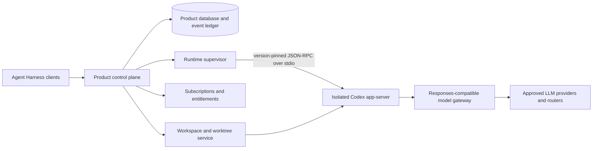

# Codex full-capability architecture and roadmap

- Status: Living production roadmap; foundation slice implemented
- Baseline date: 2026-09-02
- Codex upstream commit: `e8b3253fed5aeef7e914441bc3b73b3b0a718b51`
- Primary upstream interface: Codex App Server v2 over stdio

## Purpose

This document defines how Agent Harness should grow from its current production-foundation preview into a production multi-user agent platform without turning the product into a deep fork of Codex. The preview already has a narrow Codex bridge plus versioned migrations, tenant/workspace/thread bindings, and transactional run admission; the capability breadth and production controls below remain staged.

The [official Codex App Server documentation](https://developers.openai.com/codex/app-server) describes app-server as the interface for rich product integrations that need authentication, conversation history, approvals, and streamed agent events. The same page currently warns that the app-server command and WebSocket transport are experimental and unsupported for production workloads. The app-server protocol is therefore a useful execution boundary for Agent Harness, but broad production deployment requires explicit release-owner risk acceptance, a pinned binary, compatibility tests, isolation, canaries, and rollback. It is not a public multi-tenant API, subscription authority, provider gateway, or product database.

This roadmap is tied to the pinned upstream commit above. Method names and maturity classifications come from `codex/codex-rs/app-server-protocol/src/protocol/common.rs`; request and response semantics come from the adjacent v2 protocol modules. A future Codex upgrade must regenerate and review both TypeScript and JSON Schema artifacts before its capabilities are accepted.

## Maturity terminology

In this document:

- **Stable** means the method is not annotated as experimental in the pinned app-server protocol registry. A stable method may still contain individually gated experimental fields. This is a local protocol classification, not an upstream production-support commitment.
- **Experimental** means the method, event, or field requires `capabilities.experimentalApi = true`, is described as experimental, or lacks a compatibility guarantee suitable for broad production use.
- **Privileged** means the operation is security-sensitive even if its protocol shape is stable. Protocol stability is not authorization to expose it.
- **Product-ready** means Agent Harness has typed request handling, event reduction, persistence/reconnect behavior, authorization, audit, quotas, tests, observability, and a kill switch for the capability.

## Architecture boundary

### Strict ownership split

| Concern | Product-owned: Agent Harness | Codex-owned: app-server runtime |
| --- | --- | --- |
| Identity and tenancy | Authentication, sessions, organizations, membership, roles, platform administration, tenant scoping, and public resource IDs | No authority over product identity or tenant membership |
| Authorization and policy | Route authorization, model and tool allow-lists, permission profiles, approval policy, feature flags, data retention, egress policy, and audit | Enforces the selected runtime sandbox and emits approval or interaction requests |
| Subscriptions and quotas | Plan state, seats, entitlements, quota reservation, concurrency limits, budget enforcement, and financial ledger | Emits runtime usage signals; never decides whether a tenant is entitled to run |
| Providers and credentials | Provider connections, secret storage, gateway aliases, failover, routing, pricing versions, spend reconciliation, and short-lived runtime credentials | Reads a supervisor-generated provider configuration and speaks the supported model wire protocol |
| Public API and UI | Stable product contracts, thread catalog, search, pagination, SSE/WebSocket replay, notifications, approvals UI, terminal UI, and admin UX | Defines private runtime JSON-RPC request, response, item, and event semantics |
| Threads and turns | Maps product IDs to tenant-scoped Codex IDs, persists a normalized read model, and orchestrates lifecycle operations | Executes thread and turn semantics, produces items, maintains runtime history, compacts context, and performs reviews |
| Tools and collaboration | Decides which capabilities are allowed, records approvals, presents tool/subagent state, and applies product quotas | Plans and executes permitted tools, MCP calls, skills, and collaboration/subagent tool calls |
| Workspaces and worktrees | Repository grants, checkout/worktree creation, branch policy, ownership, mount policy, cleanup, backup, and placement | Operates only inside the cwd and filesystem boundary supplied by the supervisor |
| Skills, apps, plugins, and MCP | Catalog policy, installation authorization, tenant grants, connection secrets, revocation, and UI | Discovers and runs enabled runtime extensions according to Codex protocol semantics |
| Configuration | Owns a layered, validated configuration policy and preserves user-approved settings | Parses Codex configuration and reports effective values, requirements, and capability metadata |
| Runtime operations | Process/container placement, one trust boundary per user/workspace, health, idle eviction, resource limits, restart, recovery, and schema compatibility | Owns agent execution inside one supervised process and its private `CODEX_HOME` |

The integration adapter is product-owned. It translates version-pinned Codex types into stable Agent Harness domain types. It must not expose arbitrary app-server JSON-RPC to browsers, infer billing state from Codex, or reimplement Codex's planner and turn engine.

### Non-negotiable boundary rules

1. A browser never connects directly to app-server and never chooses arbitrary RPC methods, provider endpoints, credentials, runtime paths, or tenant identifiers.
2. Mutually untrusted tenants do not share a Codex process, writable workspace, `CODEX_HOME`, socket, or gateway credential.
3. Codex runtime records are execution evidence. Product authorization, subscriptions, quotas, resource ownership, audit, and public IDs remain authoritative in the control-plane database.
4. Agent Harness owns git worktree lifecycle. No app-server method in the pinned protocol creates, hands off, or deletes product worktrees.
5. Agent Harness selects which experimental surfaces exist. Enabling the global experimental handshake does not automatically authorize every experimental method or field.
6. Stable but unsandboxed operations are treated as privileged or prohibited. Maturity and security are separate decisions.

## Stable-versus-experimental gating policy

### Capability classes

| Class | Default | Admission requirements | Examples |
| --- | --- | --- | --- |
| Stable, sandbox-compatible | Allowed only through typed product endpoints | Generated schema is pinned; authorization, reducer, persistence, reconnect, audit, quotas, tests, and rollback exist | Thread lifecycle, goals, turn start/steer/interrupt, review, sandboxed `command/exec` |
| Stable, privileged | Denied to ordinary users | Explicit administrator policy, isolated execution boundary, high-risk confirmation, immutable audit, narrow inputs, and emergency kill switch | `thread/shellCommand`, config writes, plugin installation |
| Experimental, controlled beta | Disabled by default | Pinned commit and schema digest, tenant allow-list, method-specific server whitelist, complete request/event handlers, compatibility tests, telemetry, fallback, and kill switch | Collaboration mode, projects, remote environments, background terminals, request-user-input forms |
| Experimental or under-development catalog | Disabled in production | Separate security and supply-chain review plus all controlled-beta requirements | Remote plugin marketplace search/install/read flows |
| Unknown or incompatible | Fail closed | Must be classified in a reviewed protocol upgrade | Unknown server requests, unknown privileged methods, incompatible fields |

### Handshake and version policy

- Production runtime pools initialize with `capabilities.experimentalApi = false` unless the pool is dedicated to an approved beta capability.
- A beta pool may enable the experimental handshake, but its control-plane method whitelist remains capability-specific. Global opt-in is never a global authorization grant.
- Every release records the Codex commit, binary digest, generated TypeScript schema digest, generated JSON Schema digest, enabled stable features, enabled experiments, and required server-request handlers.
- CI regenerates schemas from the release binary and fails on an unexplained diff. The upstream generation commands are documented in `codex/codex-rs/app-server/README.md:57` and in the official App Server documentation.
- Field-level experimental markers are enforced even when their parent method is stable. For example, `thread/start`, `thread/resume`, `thread/fork`, and `turn/start` contain both stable and gated fields in `codex/codex-rs/app-server-protocol/src/protocol/v2/thread.rs:62` and `codex/codex-rs/app-server-protocol/src/protocol/v2/turn.rs:152`.
- Unknown notifications are retained as redacted diagnostics and do not crash a stream. Unknown server-to-client requests receive a prompt typed error or safe decline so a turn cannot wait forever.
- Any capability that cannot survive refresh, reconnect, runtime restart, duplicate delivery, and out-of-order terminal events is not product-ready.

### Transport policy

Use stdio between the supervisor and local app-server. The pinned repository documents stdio as supported and WebSocket transport as experimental in `codex/codex-rs/app-server/README.md:24`. The official documentation currently gives the broader production-support warning recorded above. A private Unix socket may be evaluated for supervised reconnects, but app-server is never placed on a public listener. Until the official maturity designation changes, every production promotion needs an explicit exception backed by the release gates in this document.

## Capability matrix

| Area | Pinned Codex capability | Agent Harness currently exposes | Production direction |
| --- | --- | --- | --- |
| Thread lifecycle | Stable `thread/start`, `resume`, `fork`, `archive`, `unarchive`, `delete`, `unsubscribe`, `name/set`, `compact`, `revert`, `list`, `loaded/list`, `read`, paginated `turns/list`, and `items/list`. Stable section CRUD/move supports the server-defined pinned section. Queue, settings, project, and some ancestry features are experimental. Registry: `codex/codex-rs/app-server-protocol/src/protocol/common.rs:514`, `:652`, `:695`, `:700`, `:748`, `:781`; types: `codex/codex-rs/app-server-protocol/src/protocol/v2/thread.rs:62`. | New tasks use `POST /api/tasks` with an opaque saved-project ID; the server selects the route/model, verifies the returned cwd/model, and atomically commits binding, receipt, usage, and audit. Typed endpoints expose resume, rename, fork, archive, and unarchive with durable mutation receipts. Authorized history hydrates the latest 160 normalized items. | Add product-owned pagination and normalized event history, then section move/pin, delete/retention, compact, revert, an archived-task browser, and reconnect-safe resume before project/queue experiments. |
| Thread status and goals | Stable status, lifecycle notifications, and goal set/get/clear. Goals include objective, status, token budget, token use, and elapsed time in `codex/codex-rs/app-server-protocol/src/protocol/v2/thread.rs:770`. | Goals are absent. `notLoaded` is mapped to product status `completed` in `apps/server/src/codex/adapter.ts:127`, which loses the distinction between unloaded and completed work. | Model unloaded state explicitly and make Codex goals a first-class thread feature with product entitlement and budget policy around them. |
| Turns, steering, and interruption | Stable `turn/start`, `turn/steer`, and `turn/interrupt` at `codex/codex-rs/app-server-protocol/src/protocol/common.rs:972`. Stable start fields include client ID, multimodal input, cwd, model, service tier, reasoning effort, summary, personality, and output schema; steer checks `expectedTurnId` in `codex/codex-rs/app-server-protocol/src/protocol/v2/turn.rs:152`. | Text-only starts are admitted against the owned binding, current grant, server-selected route/model, entitlements, request quota, and active-run limit. The web client retains stable task/turn keys across uncertain in-tab retries. Exact active-turn steering and interruption are typed, authorized, audited, and reflected by cross-task liveness events. | Persist client retry intent across browser restarts, then add multimodal artifact references, per-turn model/capability controls, and complete reconnect reconciliation. |
| Reviews | Stable `review/start` supports uncommitted changes, base branch, commit, and custom targets with inline or detached delivery. Registry: `codex/codex-rs/app-server-protocol/src/protocol/common.rs:1037`; types: `codex/codex-rs/app-server-protocol/src/protocol/v2/review.rs:14`. | A typed, metered, audited API validates all stable target shapes but permits inline delivery only. The Reviews UI starts an uncommitted-changes review on an authorized task and returns to its Run Spine; reported file-change and command evidence is rendered without synthetic scores. | Normalize review items/findings and cancellation, add richer target selection, then add detached delivery only with product-owned worktree, ownership, quota, and cleanup semantics. |
| Commands and terminals | Stable sandboxed `command/exec`, write, terminate, and resize support TTY and streamed output in `codex/codex-rs/app-server-protocol/src/protocol/v2/command_exec.rs:21`. `thread/shellCommand` is explicitly unsandboxed at `codex/codex-rs/app-server-protocol/src/protocol/v2/thread.rs:1122`. Background terminals and unsandboxed `process/spawn` are experimental at `codex/codex-rs/app-server-protocol/src/protocol/common.rs:673` and `:1297`. | Command items are partially normalized, but the browser has no interactive terminal. The event reducer handles command start but not the complete terminal lifecycle in `apps/web/src/App.tsx:76`. | Implement sandboxed `command/exec` with TTY, bounded output, input, resize, terminate, ownership checks, redaction, idle timeout, and audit. Keep unsandboxed shell/process operations out of general availability. |
| Approvals, permissions, and user input | Server requests cover command approval, file approval, request-user-input forms, MCP elicitation, structured permission approval, dynamic tool calls, and ChatGPT token refresh at `codex/codex-rs/app-server-protocol/src/protocol/common.rs:1690`. Command decisions include session acceptance and structured exec/network amendments in `codex/codex-rs/app-server-protocol/src/protocol/v2/item.rs:60`; permission types are in `codex/codex-rs/app-server-protocol/src/protocol/v2/permissions.rs:770`. | Only command and file approvals are interactive. Pending approvals are memory-only with a 30-minute TTL; reconnect does not replay them and the response schema cannot express policy amendments. Unsupported server requests now receive JSON-RPC `-32601` immediately, so they fail closed instead of leaving the turn waiting. | Build a durable pending-interaction store and typed handlers for every enabled request. Add permission amendments, forms, MCP elicitation, dynamic-tool callbacks, replay, expiry, cancellation, and exactly-once audit semantics before enabling their initiating features. |
| Event and item model | Thread, turn, plan, diff, item, reasoning, command, file, MCP, app, account, usage, reroute, safety, warning, and error notifications are registered from `codex/codex-rs/app-server-protocol/src/protocol/common.rs:1843`. Thread items include messages, reasoning, commands, file changes, MCP, dynamic tools, collaboration, web search, image work, review, and compaction in `codex/codex-rs/app-server-protocol/src/protocol/v2/item.rs:229`. | The runtime forwards raw JSON events. SSE has origin/backpressure controls but no event ID/replay. The frontend reconciles turn start/completion across the user's tasks, accepts timeline methods only for the selected thread, buffers by count/bytes, and warns on overflow. Command and file-change items plus collaboration ancestry are normalized, but the reducer remains partial. | Introduce a typed event envelope and complete per-thread reducer, persist normalized terminal state, retain redacted raw diagnostics, assign event IDs, support replay/automatic reconciliation, and separate thread-specific views from a user-wide attention feed. |
| Skills, apps, plugins, and MCP | Skills list/config/extra roots, app list/read/installed, and useful MCP status/OAuth/resource/tool surfaces are available. Sources: `codex/codex-rs/app-server-protocol/src/protocol/v2/plugin.rs:20`, `codex/codex-rs/app-server-protocol/src/protocol/v2/apps.rs:12`, and `codex/codex-rs/app-server-protocol/src/protocol/v2/mcp.rs:49`. Several remote marketplace plugin operations are still documented as under development. | No product endpoints or UI. The generic bridge can issue arbitrary strings internally, but the browser whitelist correctly blocks them. MCP server requests and extension events have no product handler. | Integrate local skills and app inventory first, then administrator-approved MCP status/OAuth/tooling. Treat catalog grants, credentials, installation, update, and revocation as product policy. Keep remote marketplace operations behind beta gates. |
| Models, providers, and config | Stable `model/list` exposes reasoning efforts, modalities, service tiers, and `multiAgentVersion`; provider capability and config read/write/batch/requirements surfaces are available. Sources: `codex/codex-rs/app-server-protocol/src/protocol/v2/model.rs:27` and `codex/codex-rs/app-server-protocol/src/protocol/v2/config.rs:382`. | Provider records are tenant-wide and administrator-managed; admission pins the exact enabled provider/model decision through dispatch and rejects arbitrary client overrides. The Capabilities view reports redacted model, provider-feature, and permission-profile summaries. Public endpoints require HTTPS, private/local endpoints require deployment opt-in, and gateway-backed catalog entries are pinned to the operator LiteLLM URL. | Add connection validation/rotation, personal/shared policy, per-project grants, per-thread provider/model selection, capability validation, gateway health, and resolver/connect-time egress enforcement. Replace full-file ownership with validated layered config or a merge of Harness-owned stanzas. |
| Collaboration and subagents | Item types represent collaboration tool calls and subagent activity. Tool names include spawn, send, resume, wait, close, follow-up, interrupt, and list in `codex/codex-rs/app-server-protocol/src/protocol/v2/item.rs:1102`. Models declare multi-agent support. `collaborationMode/list` and ancestry/project fields are experimental at `codex/codex-rs/app-server-protocol/src/protocol/common.rs:1112`. | Stable parent, nickname, role, source, and agent activity fields are normalized into task summaries and a cycle-safe read-only Agents hierarchy. Opening a child task is live; the browser cannot invent, spawn, message, or merge agents. | Let Codex own model-issued collaboration semantics. Add complete collaboration item normalization, usage attribution, attention, and audit before any compatible pinned-model beta selection. |
| Worktrees, projects, and remote environments | Project CRUD and environment add/info/status are experimental at `codex/codex-rs/app-server-protocol/src/protocol/common.rs:707` and `:1126`. Worktree implementation is a separate upstream crate rooted at `codex/codex-rs/worktree/src/lib.rs:1`; the app-server registry has no product worktree lifecycle RPC. | Workspace paths are canonicalized, restricted to configured roots, durably registered as tenant Saved Projects, and bound to threads per user. Administrators can register, rename, enable, and disable existing granted workspaces; members read them. Revoking a grant blocks starts, turns, resume, and history. There is no worktree lifecycle, placement, or remote environment service. | Build a product-owned checkout/worktree service with repository/branch/ref validation, isolation, locking, cleanup, and recovery. Add remote environments later behind experimental adapters and health gates. |
| Usage, rate limits, and subscriptions | `thread/tokenUsage/updated` includes latest/total tokens and context-window information. Account usage and rate-limit snapshots plus estimated thread credit/USD breakdown are defined in `codex/codex-rs/app-server-protocol/src/protocol/v2/account.rs:314` and `codex/codex-rs/app-server-protocol/src/protocol/v2/thread_usage.rs:6`. | Versioned entitlement snapshots gate subscription status, route allowlist, seat creation/reactivation, active-run concurrency, and request quota in immediate transactions. Reservations are tenant/user/thread/turn correlated and settle append-only token events. Usage renders current-period aggregate requests/runs/seats/tokens. Stripe processing durably deduplicates event IDs, rejects older state, preserves periods, and commits subscription/entitlement/audit atomically. Monetary budgets/prices and gateway/provider cost reconciliation are absent. | Add durable raw-event ingestion and same-timestamp ordering, monetary budgets, logical retry IDs, per-event usage/price views, gateway truth reconciliation, exports/alerts, and finance-grade reconciliation. Use Codex account endpoints only for the applicable OpenAI/ChatGPT account route. |
| Product audit | Codex emits execution events but is not the tenant or platform audit authority. | Administrators can read the latest 100 tenant audit events through an admin-only API/UI; metadata is reduced to scalar values before browser delivery. Authentication, user, provider, approval, and billing mutations write audit rows. | Add pagination/search/export, actor/target resolution, retention/legal hold, tamper evidence, platform-scope separation, alerts, and durable interaction/event provenance. |

## Current bridge strengths

The existing bridge is a useful foundation:

- It starts one supervised process with a private user runtime directory and `CODEX_HOME`; see `apps/server/src/codex/runtime.ts:191` and `apps/server/src/codex/config.ts:185`.
- It uses the supported stdio transport at `apps/server/src/codex/runtime.ts:296`.
- It canonicalizes cwd and restricts it to configured workspace roots at `apps/server/src/codex/config.ts:221`.
- It keeps the browser behind a narrow server-side method schema at `apps/server/src/routes/codex.ts:53`.
- It validates SSE origin, bounds queued bytes, and handles downstream backpressure at `apps/server/src/routes/codex.ts:300`.
- It associates approval resolution with the authenticated tenant/user and writes an audit record at `apps/server/src/routes/codex.ts:260`.
- It keeps provider secrets out of browser payloads and injects the selected secret through the runtime environment at `apps/server/src/codex/config.ts:101`.
- It defaults `capabilities.experimentalApi` off and immediately returns JSON-RPC method-not-found for unsupported app-server requests.
- It persists checksummed migration versions, tenant workspace grants, thread/workspace ownership, entitlement snapshots, quota reservations, and usage events.
- It admits starts against server-selected route/model and current tenant policy in one SQLite write transaction, including a tested two-process quota race.
- It correlates usage with the exact returned turn, reads incremental token measurements from `thread/tokenUsage/updated`, renews an active lease, and closes orphaned reservations on restart.
- It rejects public HTTP, obvious private/metadata targets by default, and tenant-selected LiteLLM gateway locations; private/local endpoints require deployment opt-in.
- It authorizes and lazily hydrates selected/deep-linked task history, then isolates bounded live UI updates to the selected thread.
- It exposes a durable administrator-managed Saved Projects registry plus truthful Reviews, Agents, Environments, Capabilities, aggregate Usage, and tenant-administrator Audit surfaces.
- It serializes seat admission and durably records processed Stripe event outcomes with stale-event rejection and atomic subscription/entitlement/audit mutation.

## Current bridge risks

These are ordered by production risk:

1. **Reconnect and interaction loss:** SSE frames have no IDs or replay, command/file approvals remain memory-only, and a fresh connection receives no pending-interaction snapshot. Unsupported request kinds fail closed but are not product workflows.
2. **No background attention or replay:** the server feed is user-wide, while the browser intentionally presents only selected-thread events. Other tasks cannot contaminate the Run Spine, but their approvals/attention are not surfaced until selected; overflow warns without automatically reconciling a snapshot.
3. **Bounded runtime-derived history and incomplete reducer:** selected tasks hydrate only the latest 160 normalized items from Codex, not a paginated product event store. Terminal lifecycle, file patches, MCP activity, reviews, collaboration, plans, diffs, status, usage, warnings, and errors remain partially handled or ignored.
4. **Protocol drift:** the runtime transports raw JSON values and the product contract contains a much smaller model, but no generated version-pinned adapter protects the boundary.
5. **Configuration loss:** supervisor startup/provider changes overwrite the entire Codex config, conflicting with future settings, skills, MCP, and app configuration.
6. **Single tenant-default route:** multiple enabled provider connections cannot be selected or granted per user/project/thread, and there is no health-based fallback policy.
7. **Incomplete economic controls:** seat/active-run/request limits and processed Stripe event deduplication/stale rejection exist, but monetary budgets, versioned prices, a durable raw-event workflow, deterministic same-timestamp ordering, and provider/gateway cost reconciliation do not. Incremental Codex token totals remain in process until completion, so restart fails the orphan but cannot reconcile partial usage by itself.
8. **Retry gap:** the web client generates an HTTP idempotency key for each invocation, but does not retain the same logical key across an uncertain manual retry.
9. **Unbounded runtime residency:** per-user processes have no plan-aware idle eviction, multi-host lease fencing, or placement capacity policy, and same-OS-user child processes are not hostile-tenant isolation.
10. **Shared connection policy is implicit:** provider credentials are tenant-level. The product must deliberately distinguish organization-shared routes from personal connections and audit both.
11. **Residual provider egress risk:** URL admission blocks obvious prohibited targets but cannot eliminate DNS rebinding or redirect-to-private behavior without resolver/connect-time enforcement.
12. **No workspace-grant administration API:** the Projects projection and durable grants exist, but project/grant mutation still relies on development/bootstrap provisioning rather than an audited organization administration workflow.
13. **Read-only audit is not governance:** tenant administrators can inspect recent scalar-safe rows, but there is no search/export, retention/legal-hold policy, tamper evidence, or separately scoped platform audit service.

## Event and interaction correctness contract

Before a capability is exposed, the adapter must satisfy these invariants:

1. Every command carries authenticated tenant, user, product thread, Codex thread, turn, runtime, and idempotency identifiers.
2. Every server request is stored before delivery and reaches exactly one terminal state: resolved, declined, cancelled, expired, or failed.
3. A duplicate resolution cannot execute the underlying action twice.
4. Events are reduced by `(runtime, thread, turn, item)` and terminal item state is monotonic unless a documented Codex event permits otherwise.
5. Reconnect starts from an acknowledged event cursor and follows with an authoritative thread/item reconciliation.
6. Unknown notifications are redacted, metered, and observable. Unknown requests fail closed immediately.
7. Approval decisions bind to a digest of the displayed action and the same tenant, user, thread, turn, and item that requested approval.
8. Runtime restart never silently changes provider, permission, sandbox, experimental, or extension policy for an existing thread.

## Staged integration plan

### Stage 0: Protocol and safety foundation

- Generate and vendor the v2 TypeScript and JSON Schema bundles from the pinned release binary.
- Replace raw browser-facing RPC concepts with typed product commands and typed adapter handlers.
- Default `experimentalApi` to false; create a versioned capability manifest and tenant kill switches.
- Add an exhaustive server-request dispatcher with a safe terminal fallback.
- Persist pending interactions and implement event IDs, bounded replay, reconciliation, thread filtering, and raw-event redaction.
- Add plan-aware runtime concurrency limits, idle eviction, restart policy, and health telemetry.
- Replace full-file config overwrite with a documented layered/merge strategy.

Exit gate: no supported request can hang without a visible pending state, and reconnect/restart tests preserve authoritative state.

### Stage 1: Stable thread and turn parity

- Implement paginated list/read/turns/items hydration.
- Add resume, fork, rename, archive, unarchive, delete, unsubscribe, sections/pin, goals, compact, and revert.
- Add turn client IDs, model capability checks, multimodal references, steer, and interrupt.
- Normalize every stable item/event type and apply both start and completion transitions.
- Add `review/start` and review/diff rendering.

Exit gate: lifecycle, pagination, duplicate submission, interrupt, reconnect, archive, fork, and review contract suites pass against the pinned binary.

### Stage 2: Permissions and sandboxed terminal

- Implement command, file, and structured permission approval workflows, including session and policy-amendment decisions.
- Add sandboxed `command/exec` terminal sessions with TTY, output limits, input, resize, terminate, idle timeout, and audit.
- Add request-user-input only in a controlled beta after durable form/replay semantics exist.
- Keep `thread/shellCommand` and `process/spawn` disabled for ordinary product users.

Exit gate: approval replay/race tests, terminal ownership tests, sandbox negative tests, and output redaction tests pass.

### Stage 3: Models, providers, skills, apps, MCP, and collaboration

- Add provider/model discovery, connection validation, per-project grants, per-thread selection, fallback, and health.
- Add stable local skills and app inventory/configuration surfaces.
- Add administrator-approved MCP status, OAuth, resource, elicitation, and tool workflows.
- Render collaboration/subagent topology and activity from Codex items; meter child work against the originating tenant and goal.
- Keep collaboration mode, ancestry filters, and remote plugin marketplace operations behind pinned-version beta gates.

Exit gate: provider compatibility, secret isolation, extension revocation, MCP approval, and multi-agent usage attribution tests pass.

### Stage 4: Worktrees, projects, and environments

- Implement product-owned repository checkout and worktree lifecycle with locking, branch/ref validation, cleanup, retention, and disaster recovery.
- Bind every thread to an authorized workspace version and pass only validated cwd values to Codex.
- Introduce experimental Codex project/environment adapters only for allow-listed tenants and pinned server versions.
- Add remote environment health, root policy, network policy, and disconnect recovery.

Exit gate: cross-tenant filesystem tests, symlink/path traversal tests, concurrent worktree tests, cleanup tests, and remote disconnect recovery pass.

### Stage 5: Subscriptions, usage, and governance

- Extend the implemented subscription, seat, runtime/turn concurrency, and request-reservation checks to plan features and monetary budgets.
- Extend the tenant/user/thread/turn/route/model usage records and current-period summary into a complete immutable, queryable usage ledger.
- Reconcile Codex token events with gateway/provider usage and versioned prices; never trust client-reported cost.
- Add budgets, rate-limit UX, alerts, exports, retention, deletion, and search over the existing tenant audit read surface.
- Promote processed Stripe-event deduplication/stale rejection into a durable raw-event workflow with deterministic ordering, retries, reconciliation, and finance operations.
- Separate OpenAI/ChatGPT account limit displays from third-party provider/router billing.

Exit gate: quota race, cancellation, retry, duplicate webhook, price-version, provider discrepancy, and tenant export tests pass.

### Stage 6: Advanced experimental workflows

Evaluate queues, project automation, background terminals, remote control, richer environment orchestration, and other upstream experiments only after the stable core meets production SLOs. Each capability receives its own threat model, compatibility adapter, beta cohort, telemetry, and rollback plan.

## Release acceptance checklist

- [ ] Release binary commit and schema digests match the capability manifest.
- [ ] All enabled methods and fields have an explicit stable or experimental classification.
- [ ] Every enabled server request has a typed, terminal response path.
- [ ] Unknown server requests fail closed without hanging a turn.
- [ ] Thread/item state survives refresh, SSE reconnect, runtime restart, and duplicate events.
- [ ] Browser and public API cannot invoke arbitrary app-server methods.
- [ ] Provider credentials remain outside browser payloads, workspaces, prompts, tool output, and logs.
- [ ] Tenant, workspace, runtime, thread, approval, and terminal isolation negative tests pass.
- [ ] Subscription, quota reservation, usage reconciliation, and audit tests pass.
- [ ] Experimental features can be disabled per tenant without a deployment.
- [ ] Unsandboxed operations remain disabled or use a separately approved privileged workflow.
- [ ] Upgrade rollback has been exercised against existing thread history.

## Primary source index

### Official documentation

- [Codex App Server](https://developers.openai.com/codex/app-server)

### Pinned upstream protocol

- `codex/codex-rs/app-server/README.md`
- `codex/codex-rs/app-server-protocol/src/protocol/common.rs`
- `codex/codex-rs/app-server-protocol/src/protocol/v2/thread.rs`
- `codex/codex-rs/app-server-protocol/src/protocol/v2/turn.rs`
- `codex/codex-rs/app-server-protocol/src/protocol/v2/item.rs`
- `codex/codex-rs/app-server-protocol/src/protocol/v2/review.rs`
- `codex/codex-rs/app-server-protocol/src/protocol/v2/permissions.rs`
- `codex/codex-rs/app-server-protocol/src/protocol/v2/command_exec.rs`
- `codex/codex-rs/app-server-protocol/src/protocol/v2/process.rs`
- `codex/codex-rs/app-server-protocol/src/protocol/v2/model.rs`
- `codex/codex-rs/app-server-protocol/src/protocol/v2/config.rs`
- `codex/codex-rs/app-server-protocol/src/protocol/v2/plugin.rs`
- `codex/codex-rs/app-server-protocol/src/protocol/v2/apps.rs`
- `codex/codex-rs/app-server-protocol/src/protocol/v2/mcp.rs`
- `codex/codex-rs/app-server-protocol/src/protocol/v2/account.rs`
- `codex/codex-rs/app-server-protocol/src/protocol/v2/thread_usage.rs`
- `codex/codex-rs/worktree/src/lib.rs`

### Current Agent Harness bridge

- `apps/server/src/codex/runtime.ts`
- `apps/server/src/codex/config.ts`
- `apps/server/src/codex/adapter.ts`
- `apps/server/src/routes/codex.ts`
- `apps/server/src/routes/providers.ts`
- `apps/server/src/routes/billing.ts`
- `apps/server/src/database.ts`
- `apps/web/src/App.tsx`
- `apps/web/src/lib/api.ts`
- `packages/contracts/src/index.ts`
